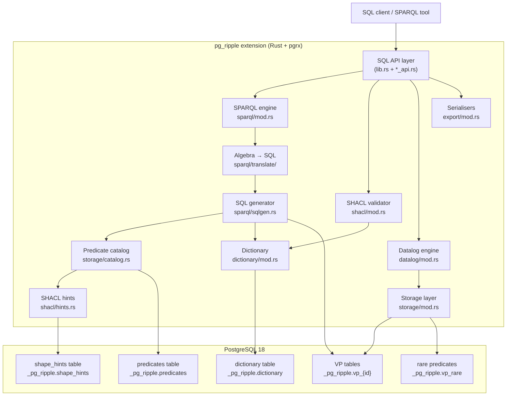

# Architecture

This page describes the internal architecture of pg_ripple as of v0.38.0.

## Overview

pg_ripple is a PostgreSQL 18 extension written in Rust (pgrx 0.17) that
implements a high-performance RDF triple store with native SPARQL query
execution.  All user-visible functions live in the `pg_ripple` schema; internal
tables and VP (Vertical Partitioning) tables live in the `_pg_ripple` schema.

## Component map



## Source tree structure

| Path | Responsibility |
|------|---------------|
| `src/lib.rs` | pgrx entry points, GUC registration, `_PG_init`, hooks |
| `src/gucs.rs` | All GUC `static` declarations |
| `src/schema.rs` | `extension_sql!()` DDL blocks |
| `src/dictionary/` | IRI / blank-node / literal → `i64` encoder (XXH3-128 + LRU) |
| `src/storage/` | VP table I/O, HTAP delta/main partitions, merge worker |
| `src/storage/catalog.rs` | Predicate → VP table OID cache (SPI call reduction) |
| `src/sparql/` | SPARQL text → algebra → SQL → SPI → decode |
| `src/sparql/translate/` | Per-algebra-node translation stubs (BGP, Join, Filter, …) |
| `src/sparql/plan_cache.rs` | Per-backend plan cache keyed on algebra digest (XXH3-128) |
| `src/datalog/` | Datalog rule parser, stratifier, SQL compiler |
| `src/shacl/` | SHACL shapes → validation pipeline |
| `src/shacl/constraints/` | Per-constraint-type validation (count, string, logical, …) |
| `src/shacl/hints.rs` | SHACL → SQL generation hints (join type, DISTINCT) |
| `src/export/` | Turtle / N-Triples / JSON-LD serialisation |
| `src/federation_registry.rs` | SPARQL federation endpoint registry |
| `src/stats_admin.rs` | Monitoring, pg_stat_statements integration |
| `src/graphrag_admin.rs` | Vector embedding, hybrid search, GraphRAG pipeline |
| `src/*_api.rs` | SQL-exposed pg_extern wrappers |

## Storage model

Every IRI, blank node, and literal is mapped to a `BIGINT` (i64) through a
dictionary encoding step (XXH3-128 hash).  VP tables **never** contain raw
strings — all joins are integer joins.

```
          raw IRI/literal
               │
      dictionary.encode()
               │
           i64 hash
               │
     stored in VP table (s, o, g, i, source)
```

For each unique predicate there is one VP table: `_pg_ripple.vp_{predicate_id}`.
Predicates with fewer than `vp_promotion_threshold` (default: 1 000) triples are
stored in the consolidated `_pg_ripple.vp_rare` table instead.

## Query execution pipeline

```
SPARQL text
    │
    ▼ spargebra::Query::parse()
SPARQL algebra
    │
    ▼ sparopt optimizer (BGP reorder, join order)
Optimised algebra
    │
    ▼ SPARQL→SQL translator (sqlgen.rs + translate/)
SQL text
    │
    ▼ PostgreSQL SPI executor
Raw rows
    │
    ▼ dictionary.decode()
JSONB result set
```

## Plan cache

The per-backend plan cache (v0.13.0) maps an **algebra digest** to the
generated SQL.  The digest is computed as:

```
digest = XXH3-128( spargebra::Query::display(query) )
key    = "{digest}\x00max_depth={n}\x00bgp_reorder={b}"
```

Using the algebra display form (rather than the raw query text) means
whitespace and prefix-alias variants of the same query share one cache slot.

## SHACL hints integration

After loading shapes with `pg_ripple.load_shacl()`, predicate-level hints are
written to `_pg_ripple.shape_hints`.  The SQL generator reads these hints
via the predicate catalog to:

- Omit `DISTINCT` when `sh:maxCount 1` is set for a predicate.
- Use `INNER JOIN` instead of `LEFT JOIN` when `sh:minCount 1` is set.

Hints are invalidated automatically when shapes are dropped
(`pg_ripple.invalidate_catalog_cache()`).
