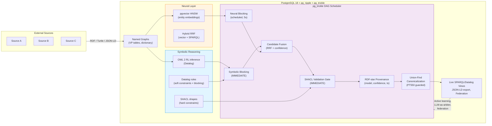

# Neuro-Symbolic Record Linkage × pg_ripple × pg_trickle: Synergy Analysis

> **Date**: 2026-04-22 (v2.0 — expanded with LLM-era research, AI agent authoring layer, three new synergies, PPRL worked example, deployment patterns, production concerns, and evaluation methodology)
> **Status**: Strategic research report
> **Audience**: pg_ripple developers, knowledge-graph practitioners, data-integration architects, ER tooling decision-makers

---

## Executive Summary

**Neuro-symbolic record linkage** (NS-RL) is the production-ready synthesis of two historically separate traditions in entity resolution: the *symbolic* tradition (ontology axioms, logical rules, formal constraints — explainable, auditable, but brittle to noise) and the *neural* tradition (embedding similarity, pre-trained language models, GNNs — fuzzy and high-recall, but opaque and unconstrained). NS-RL combines them so that neural models provide the high-recall blocking and fuzzy matching that rules cannot anticipate, while symbolic constraints enforce hard correctness invariants that neural models will routinely violate ("two patients with different blood types are not the same person, regardless of name similarity").

The paradigm has moved decisively from research to production. As of 2026, the dominant practical pattern is a five-stage pipeline — *block → match → validate → canonicalize → provenance* — where each stage can be neural, symbolic, or hybrid. The frontier is now in three directions: **LLM-as-arbiter** for hard cases, **AI agents as the rule/shape authoring layer**, and **continuous resolution** that reacts to streaming data within milliseconds rather than running as nightly batches.

**pg_ripple** — a PostgreSQL 18 extension implementing a high-performance RDF triple store with native SPARQL 1.1, Datalog (with semi-naive evaluation, magic sets, well-founded semantics, lattices), SHACL, OWL 2 RL reasoning, pgvector hybrid search, RDF-star provenance, and `owl:sameAs` union-find canonicalization — provides the symbolic and neural reasoning substrate for NS-RL inside an ACID-compliant database.

**pg_trickle** — a companion PostgreSQL 18 extension providing declarative, automatically-refreshing materialized views (stream tables) powered by Incremental View Maintenance (IVM) — adds the critical fourth dimension: **real-time reactivity**. IMMEDIATE-mode stream tables fire within the same transaction that inserts a triple, enabling sameAs candidate detection, SHACL merge-conflict checks, and DAG-ordered pipeline refresh that no batch-oriented system can match.

Together, the two extensions form a **complete, in-database NS-RL platform** with no external orchestration required. This report identifies **21 concrete synergies** across the three-way intersection (7 pg_ripple × NS-RL, 6 pg_trickle × NS-RL, 8 three-way), proposes an end-to-end architecture with three deployment patterns, and provides a phased roadmap aligned to the existing pg_ripple v0.49.0–v0.52.0 release plan.

**Why this matters now**: The combined market for entity resolution, master data management, and identity graph platforms exceeds USD 8B annually (2025 estimates), with healthcare, financial services, and customer data platforms (CDPs) as the largest segments. Existing solutions force a choice between (a) opaque commercial black boxes (Senzing, Reltio, Tamr), (b) batch-only open-source toolkits (Splink, Zingg, Magellan), or (c) general-purpose graph databases without ER primitives (Neo4j, Neptune, Stardog). pg_ripple + pg_trickle is the first system to combine **symbolic correctness, neural recall, real-time reactivity, full SQL ecosystem integration, and open-source licensing** in a single deployable unit.

---

## Table of Contents

1. [What Is Neuro-Symbolic Record Linkage?](#1-what-is-neuro-symbolic-record-linkage)
2. [Background: Record Linkage Fundamentals](#2-background-record-linkage-fundamentals)
3. [The Neuro-Symbolic Paradigm](#3-the-neuro-symbolic-paradigm)
4. [Key Research and Systems](#4-key-research-and-systems)
5. [pg_ripple Capability Map](#5-pg_ripple-capability-map)
6. [pg_trickle Capability Map](#6-pg_trickle-capability-map)
7. [Synergy Analysis: pg_ripple × NS-RL](#7-synergy-analysis-pg_ripple--ns-rl)
8. [Synergy Analysis: pg_trickle × NS-RL](#8-synergy-analysis-pg_trickle--ns-rl)
9. [Synergy Analysis: pg_ripple × pg_trickle × NS-RL](#9-synergy-analysis-pg_ripple--pg_trickle--ns-rl)
10. [End-to-End NS-RL Architecture](#10-end-to-end-ns-rl-architecture)
11. [Worked Examples](#11-worked-examples)
12. [Competitive Landscape](#12-competitive-landscape)
13. [Production Concerns](#13-production-concerns)
14. [Evaluation Methodology](#14-evaluation-methodology)
15. [Gaps, Roadmap, and Future Work](#15-gaps-roadmap-and-future-work)
16. [References](#16-references)

---

## 1. What Is Neuro-Symbolic Record Linkage?

**Record linkage** (also called entity resolution, deduplication, entity matching, or identity resolution) is the task of finding records across one or more data sources that refer to the same real-world entity. It is a foundational problem in data integration, master data management, fraud detection, healthcare informatics, and knowledge graph construction.

**Neuro-symbolic record linkage** combines two complementary approaches:

| Component | Role | Strengths | Weaknesses |
|-----------|------|-----------|------------|
| **Neural** (embeddings, PLMs, GNNs) | Learn fuzzy similarity from data | High recall, handles variation and noise, transfers across domains | Opaque decisions, no hard-constraint enforcement, needs labeled data |
| **Symbolic** (OWL axioms, Datalog rules, SHACL constraints) | Encode domain knowledge as logical rules | Explainable, guarantees correctness invariants, zero-shot for known patterns | Brittle to noise, cannot handle unseen variation, combinatorial scaling |

The key insight of NS-RL is that these weaknesses are **complementary**: neural models handle the "long tail" of fuzzy variation that rules cannot anticipate, while symbolic rules enforce hard constraints that neural models may violate (e.g., "two entities with different social security numbers cannot be the same person").

---

## 2. Background: Record Linkage Fundamentals

### 2.1 The Classical Pipeline

Record linkage follows a well-established pipeline:

```
┌─────────────┐    ┌────────────┐    ┌──────────────┐    ┌──────────────┐    ┌──────────────┐
│   Data       │───▶│  Blocking   │───▶│  Pairwise     │───▶│ Classification│───▶│ Canonicali-  │
│   Ingestion  │    │  (Candidate │    │  Comparison   │    │ (Match /      │    │ zation       │
│              │    │   Pairing)  │    │              │    │  Non-match)   │    │              │
└─────────────┘    └────────────┘    └──────────────┘    └──────────────┘    └──────────────┘
```

1. **Data Ingestion**: Load records from heterogeneous sources, normalize, standardize.
2. **Blocking**: Reduce the quadratic comparison space $O(n^2)$ to a manageable set of candidate pairs by grouping records that share a coarse key (e.g., same first letter of surname, same postal code).
3. **Pairwise Comparison**: Compute similarity features between candidate pairs (string similarity, phonetic codes, numeric distance, date proximity).
4. **Classification**: Decide match / non-match / possible-match based on feature vectors.
5. **Canonicalization**: Merge matched records into a single canonical entity, resolve attribute conflicts.

### 2.2 The Fellegi–Sunter Foundation

The mathematical foundation was laid by Fellegi and Sunter (1969). For record pair $(a, b)$, a comparison vector $\gamma = (\gamma_1, \ldots, \gamma_K)$ encodes agreement/disagreement on $K$ attributes. The match weight is:

$$w(\gamma) = \log_2 \frac{m(\gamma)}{u(\gamma)}$$

where $m(\gamma) = P(\gamma \mid (a,b) \in M)$ and $u(\gamma) = P(\gamma \mid (a,b) \in U)$. Pairs with composite weight above an upper threshold are declared matches; below a lower threshold, non-matches; between the two, possible matches requiring human review.

### 2.3 Limitations of Classical Approaches

| Limitation | Impact |
|-----------|--------|
| **Conditional independence assumption** | The Fellegi–Sunter model assumes attribute comparisons are independent given match status — rarely true in practice |
| **Manual feature engineering** | Practitioners must hand-craft similarity functions for each attribute type |
| **Rule maintenance burden** | Deterministic linkage rules become unmanageable as data complexity grows |
| **No structural context** | Classical methods compare records in isolation, ignoring graph neighborhood |
| **No cross-source reasoning** | Cannot leverage ontological knowledge (e.g., "email is functionally unique") as hard constraints |
| **Batch-only processing** | No mechanism for continuous, event-driven entity resolution as new records arrive |

### 2.4 The Neural Extension of Fellegi–Sunter

NS-RL generalises the comparison vector $\gamma$ in two ways. First, components $\gamma_k$ become *real-valued* similarity scores rather than binary agreement indicators — produced by string-similarity functions, pre-trained language model encoders, or graph embedding distances. Second, the match weight is computed by a *learned* function rather than a closed-form ratio:

$$P((a,b) \in M \mid \gamma) = \sigma\left(\sum_{k=1}^{K} w_k \cdot \phi_k(\gamma_k) + \sum_{j} \lambda_j \cdot \mathbb{1}[\text{rule}_j(a,b) \text{ fires}]\right)$$

where $\phi_k$ are feature transformations (often neural), $w_k$ are learned weights, and the $\lambda_j$ terms inject *symbolic priors* — large positive weights for must-match rules (`owl:InverseFunctionalProperty` agreement) and large negative weights for must-not-match rules (`sh:disjoint` violations). When $\lambda_j \to \infty$ the rule becomes a *hard constraint* (Section 3.3); when $\lambda_j$ is finite and learned the rule contributes a *soft prior* in the spirit of Markov Logic Networks (Singla & Domingos 2006) or Probabilistic Soft Logic (Bach et al. 2017).

This formulation is what makes pg_ripple's stack natural: the symbolic terms compile to Datalog/SHACL inside the database, the neural terms compile to pgvector similarity expressions, and the combined score becomes an RDF-star annotation on the proposed `owl:sameAs` link — fully queryable, auditable, and incrementally maintainable.

### 2.5 Evaluation Metrics

Production NS-RL systems are evaluated on three orthogonal axes:

**Pairwise quality** (per-pair classification correctness):
- **Precision** $= \frac{|\text{TP}|}{|\text{TP}| + |\text{FP}|}$ — fraction of declared matches that are correct
- **Recall** $= \frac{|\text{TP}|}{|\text{TP}| + |\text{FN}|}$ — fraction of true matches that were found
- **F1** $= 2 \cdot \frac{P \cdot R}{P + R}$ — harmonic mean (the standard headline number)

**Blocking quality** (cost vs. completeness trade-off):
- **Reduction Ratio (RR)** $= 1 - \frac{|\text{candidate pairs}|}{|D_1| \times |D_2|}$ — fraction of the quadratic comparison space eliminated
- **Pairs Completeness (PC)** $= \frac{|\text{true matches in candidates}|}{|\text{all true matches}|}$ — fraction of true matches the blocker preserved
- **F-PQ** $= 2 \cdot \frac{RR \cdot PC}{RR + PC}$ — combined blocking score

**Cluster quality** (after canonicalization, on multi-source data):
- **Cluster Precision/Recall** — measured on equivalence classes rather than pairs
- **Pairwise B³** (Bagga & Baldwin 1998) — averages per-mention precision/recall over the cluster they belong to; standard for coreference-style evaluation
- **Variation of Information (VI)** — information-theoretic distance between true and predicted clusterings

Production systems should report all three. A pipeline with 99% pairwise F1 but 12% pairs completeness is useless (the blocker discarded most true matches before scoring); a pipeline with 99% PC but 20% pairwise F1 produces too many false positives to merge safely.

---

## 3. The Neuro-Symbolic Paradigm

### 3.1 Neural Components

Modern neural approaches to entity matching use:

**Pre-trained Language Models (PLMs)**: Systems like Ditto (Li et al., VLDB 2021) serialize record pairs as text sequences and fine-tune BERT/RoBERTa for binary classification. This captures deep semantic similarity ("Bill" ≈ "William") without manual feature engineering. Ditto achieves up to 29% F1 improvement over prior SOTA on standard benchmarks.

**Knowledge Graph Embeddings (KGE)**: Methods like TransE, RotatE, and ComplEx learn dense vector representations of entities and relations. Entity pairs with high embedding similarity are match candidates. This is especially powerful for cross-lingual and cross-schema matching.

**Graph Neural Networks (GNNs)**: R-GCN and CompGCN aggregate neighborhood information, so structurally similar entities (similar neighbors, similar relation patterns) have similar representations even if their attribute values differ.

**Contrastive Learning**: Self-supervised approaches learn entity representations by contrasting positive (same-entity) and negative (different-entity) pairs, reducing dependence on labeled data.

### 3.2 Symbolic Components

The symbolic side of NS-RL draws on:

**OWL 2 RL Axioms**: `owl:FunctionalProperty` and `owl:InverseFunctionalProperty` provide deterministic matching rules. If `ex:taxId` is declared an inverse-functional property, then any two entities sharing the same tax ID are necessarily the same entity — no neural scoring needed.

**Datalog Rules**: Custom blocking and matching rules expressed in Datalog can encode complex domain logic:
```prolog
% Block: only compare entities in the same postal region
candidate(?x, ?y) :- ?x ex:postalCode ?z, ?y ex:postalCode ?z, ?x != ?y.

% Match: shared inverse-functional property implies identity
?x owl:sameAs ?y :- ?x ex:taxId ?id, ?y ex:taxId ?id, ?x != ?y.
```

**SHACL Constraints**: Shape constraints act as validation gates: a proposed `owl:sameAs` link that would violate `sh:disjoint` (e.g., merging a Person with an Organization) is rejected, regardless of the neural model's confidence.

**Ontology Alignment**: OWL axioms like `owl:equivalentClass` and `owl:equivalentProperty` enable cross-schema matching: if Source A uses `schema:name` and Source B uses `foaf:name`, an `owl:equivalentProperty` declaration allows the system to compare them without manual mapping.

### 3.3 Hard vs. Soft Symbolic Constraints

A recurring source of NS-RL design errors is treating all symbolic constraints uniformly. In practice, symbolic components fall into two distinct categories with very different roles in the pipeline:

| Constraint Class | Role | Examples in pg_ripple | Failure Mode |
|------------------|------|----------------------|--------------|
| **Hard constraints** (must hold) | Reject any merge that violates them, regardless of neural confidence | `sh:disjoint`, `sh:class`, `sh:datatype`, `sh:in`, `owl:differentFrom`, conflicting functional-property values | False negatives (true matches rejected) — usually preferable to a false positive |
| **Soft constraints** (should hold) | Influence the match score but can be overridden by strong neural evidence | Datalog blocking rules with confidence weights, RDF-star confidence annotations, lattice-based trust propagation | Manifest as score adjustments, not rejections |

The correct architecture: **soft constraints contribute additively to the match score; hard constraints act as a final veto gate after scoring.** Inverting this (using soft constraints as gates, or treating hard constraints as score adjustments) produces either silent over-merging (the dangerous case) or excessive false rejections.

pg_ripple's SHACL engine naturally encodes hard constraints (validation either passes or rejects); its Datalog rules with confidence-weighted heads encode soft constraints; pg_trickle IMMEDIATE stream tables enforce the temporal ordering — *score first, gate second, in the same transaction*.

### 3.4 Interaction Patterns

There are five main patterns for combining neural and symbolic components in NS-RL:

| Pattern | Description | Example |
|---------|-------------|---------|
| **Neural→Symbolic** | Neural model proposes candidates; symbolic rules validate | Embedding similarity finds candidates; `owl:InverseFunctionalProperty` confirms; `sh:disjoint` rejects invalid merges |
| **Symbolic→Neural** | Symbolic rules generate blocking candidates; neural model scores | Datalog blocking rules restrict comparison space; BERT-based matcher scores pairs |
| **Interleaved** | Alternating neural and symbolic steps in a fixpoint loop | Neural embeddings propose sameAs → OWL RL inference propagates → new triples update embeddings → repeat |
| **Joint** | Single model with differentiable logic and neural components | Logical Neural Networks (LNN) — differentiable first-order logic gates with learned weights (IBM Research) |
| **LLM-as-Arbiter** *(2024–2026 frontier)* | LLM resolves the "uncertain zone" with structured prompts grounded in graph context | Pairs scoring 0.5–0.85 are sent to GPT-4o/Claude with the entity neighborhood as JSON-LD context; LLM returns match/non-match with cited evidence |

### 3.5 Key Research Contributions

**Foundational (1969–2010)**

- **Fellegi & Sunter (JASA 1969)** — The probabilistic foundation of record linkage; weight-based decision rule under conditional independence.
- **Markov Logic Networks** (Singla & Domingos, ICDM 2006) — Pioneered probabilistic first-order logic for ER, unifying logical rules and learned weights.
- **Probabilistic Soft Logic / PSL** (Bach et al., JMLR 2017) — Continuous-valued logic with hinge-loss MRFs; the dominant academic framework for soft-constraint NS-RL.

**Neural Era (2018–2022)**

- **DeepMatcher** (Mudgal et al., SIGMOD 2018) — First systematic study of deep learning for entity matching; demonstrated PLM superiority on textual fields.
- **Ditto** (Li et al., VLDB 2021) — Deep entity matching with pre-trained language models. 96.5% F1 on company matching (789K × 412K records). Domain knowledge injection via token highlighting bridges toward neuro-symbolic integration. Still the dominant baseline in 2026.
- **LNN-EL** (Jiang et al., ACL 2021) — Logical Neural Networks for entity linking. First-order logic rules with learned real-valued weights achieve competitive performance with black-box approaches while providing interpretable, transferable decision rules. 3%+ F1 improvement on LC-QuAD-1.0.
- **Sudowoodo** (Wang et al., ICDE 2023) — Self-supervised contrastive learning for ER without labeled data; uses augmentation operators inspired by SimCLR.
- **DeepBlocker** (Thirumuruganathan et al., VLDB 2021) — Self-supervised blocking via dense embeddings; reduces blocking false negatives by 30–50% versus rule-based blockers.

**LLM Era (2023–2026)**

- **Match-GPT** (Peeters & Bizer, BTW 2024) — GPT-4 prompting for entity matching reaches Ditto-level F1 on benchmarks **without any fine-tuning**, signalling a fundamental cost-performance shift.
- **KAER** (Fan et al., EMNLP 2023) — Knowledge-Augmented Entity Resolution — injects external KB facts into LLM prompts for matching; 4–8% F1 lift on cross-domain benchmarks.
- **BoostER** (Yao et al., ACL 2024) — LLM-based ensemble that boosts weak symbolic matchers using few-shot prompting; demonstrated transfer across 7 ER benchmarks without per-dataset training.
- **CHORUS** (Tu et al., SIGMOD 2024) — LLMs as universal data discovery primitives, including ER as one of three target tasks; the "foundation model for tabular data" thesis.
- **AnyMatch** (Zhang et al., VLDB 2024) — Small fine-tuned LLM (≤7B) matching GPT-4 quality on ER; key argument for on-prem NS-RL deployments where data residency matters.

**Knowledge Graph & Semantic Web Track**

- **Ontology Embedding** (Chen et al., TKDE 2025) — Comprehensive survey of methods that embed OWL ontologies into vector spaces for ER, query answering, and knowledge retrieval. Bridges OWL reasoning with neural embedding spaces.
- **The Ontological Compliance Gateway** (van Hurne et al., 2026) — Neuro-symbolic architecture using formal ontologies and KGs for ER in verifiable agentic AI; flagship example of NS-RL in production AI systems.
- **Semantic Web: Past, Present, and Future** (Scherp et al., TGDK 2024) — Hypothesizes that NS-AI will revitalize ER in the Semantic Web, with KGs as the integration substrate.
- **Construction of Knowledge Graphs: Current State and Challenges** (Hofer et al., Information 2024) — Surveys NS-RL as one of three open challenges for production KG construction.

**Privacy-Preserving RL (active 2020–2026)**

- **Christen, Ranbaduge & Schnell (2020)** — Bloom-filter encodings, secure multi-party computation, and differential privacy for cross-organizational ER without sharing raw PII.
- **Vatsalan et al. (TKDD 2022)** — Comprehensive PPRL survey including neural-era extensions (encrypted embedding similarity, federated ER).

---

## 4. Key Research and Systems

### 4.1 Taxonomy of NS-RL Approaches

```
Neuro-Symbolic Record Linkage
├── Embedding-Based Blocking
│   ├── KGE blocking (TransE, RotatE similarity)
│   ├── PLM blocking (BERT CLS-token similarity)
│   └── GNN blocking (R-GCN neighborhood embedding)
├── Neural Matching with Symbolic Constraints
│   ├── Ditto + domain rules (token highlighting)
│   ├── PLM matcher + OWL validation gate
│   └── Contrastive learning + SHACL shape compliance
├── Symbolic Matching with Neural Features
│   ├── Datalog rules with embedding-distance predicates
│   ├── Fellegi–Sunter with neural feature extractors
│   └── SHACL + pgvector similarity thresholds
├── Logical Neural Networks
│   ├── LNN-EL (entity linking)
│   ├── Differentiable Datalog
│   └── Neural Theorem Provers for RL
└── Knowledge Graph Alignment
    ├── Cross-KG entity alignment (MTransE, AliNet)
    ├── Ontology matching (LogMap, AML)
    └── Federated entity resolution (SERVICE + remote KGs)
```

### 4.2 Tools and Frameworks

| System | Type | Neural | Symbolic | Reactive (IVM) | License | Notes |
|--------|------|--------|----------|----------------|---------|-------|
| **Ditto** (Megagon Labs) | Open research | BERT/RoBERTa fine-tuning | Domain knowledge injection | ❌ Batch only | Apache 2.0 | The PLM baseline; reference implementation |
| **DeepMatcher / Magellan** (UW–Madison) | Open academic | Deep learning matchers | Rule-based blocking | ❌ Batch only | BSD | Foundational; superseded by Ditto on most benchmarks |
| **Sudowoodo** (HKUST) | Open research | Contrastive self-supervised | — | ❌ Batch only | Apache 2.0 | Strong on label-scarce settings |
| **LNN-EL** (IBM Research) | Open research | Differentiable logic gates | First-order logic rules | ❌ Batch only | Apache 2.0 | Joint integration; interpretable |
| **PSL** (UCSC LINQS) | Open academic | — | Hinge-loss MRFs over first-order logic | ❌ Batch only | Apache 2.0 | Mature soft-constraint framework |
| **Splink** (UK Ministry of Justice) | Open production | — | Probabilistic Fellegi–Sunter (modern) | ❌ Batch only | MIT | Backend-agnostic (DuckDB/Spark/PG); strong in healthcare/government |
| **Zingg** (Zingg AI) | Open production | Active learning + embeddings | Rule-assisted blocking | ❌ Batch only | AGPL | Spark-based; commercial support tier |
| **LogMap** (OAEI) | Open academic | Word embeddings | OWL reasoning | ❌ Batch only | LGPL | Ontology matching focus |
| **JedAI** (NTUA) | Open research toolkit | Multiple embeddings | Multiple blockers | ❌ Batch only | Apache 2.0 | Comprehensive blocking-method comparison platform |
| **Senzing** | Commercial | Proprietary | Proprietary entity-graph rules | ⚠ API-only | Proprietary | Black-box, high accuracy, no SQL/SPARQL |
| **Tamr** | Commercial | Active learning | Rule editor UI | ❌ Batch | Proprietary | Enterprise SaaS; pricey |
| **Reltio** | Commercial | ML-assisted | Workflow-driven rules | ⚠ Streaming UI | Proprietary | MDM-focused; closed ecosystem |
| **Stardog** | Commercial KG | Embedding add-on | Datalog + OWL + SHACL | ❌ Batch | Proprietary | Closest semantic-graph competitor; no IVM |
| **Neo4j + GraphDS** | Commercial KG | GDS embeddings | Cypher rules (not Datalog) | ❌ | Proprietary | LPG model; no SPARQL/SHACL |
| **pg_ripple + pg_trickle** | Open production | pgvector HNSW, hybrid RRF | OWL 2 RL, Datalog, SHACL | ✅ Real-time IVM | PostgreSQL | Full-stack NS-RL in one DB |

---

## 5. pg_ripple Capability Map

pg_ripple provides a remarkably complete set of building blocks for NS-RL:

### 5.1 Data Ingestion and Representation

| NS-RL Requirement | pg_ripple Capability | Status |
|-------------------|---------------------|--------|
| Multi-source data loading | `load_turtle()`, `load_ntriples()`, `load_rdfxml()`, `load_jsonld()` with named graphs | ✅ Shipped |
| Schema-agnostic storage | VP (Vertical Partitioning) tables with dictionary encoding | ✅ Shipped |
| Cross-source isolation | Named graphs (`g BIGINT` column in every VP table) | ✅ Shipped |
| Unique entity identifiers | XXH3-128 dictionary encoding (IRI → i64) | ✅ Shipped |
| High-throughput ingestion | HTAP delta/main architecture, batch `ON CONFLICT DO NOTHING` | ✅ Shipped |

### 5.2 Blocking (Candidate Pair Generation)

| NS-RL Requirement | pg_ripple Capability | Status |
|-------------------|---------------------|--------|
| Rule-based blocking | Datalog rules for custom blocking predicates | ✅ Shipped |
| Embedding-based blocking | pgvector HNSW k-NN self-join | ✅ Shipped |
| Hybrid blocking (rules + embeddings) | `hybrid_search()` with Reciprocal Rank Fusion | ✅ Shipped |
| Demand-filtered blocking | `infer_demand()` restricts inference to relevant predicates | ✅ Shipped (v0.31.0) |
| Federated blocking | SPARQL `SERVICE` joins local entities with remote reference KGs | ✅ Shipped |

### 5.3 Classification (Match Decision)

| NS-RL Requirement | pg_ripple Capability | Status |
|-------------------|---------------------|--------|
| Deterministic matching (shared unique key) | `owl:InverseFunctionalProperty` → automatic `owl:sameAs` inference | ✅ Shipped |
| Functional property uniqueness | `owl:FunctionalProperty` → `owl:sameAs` from shared object values | ✅ Shipped |
| Probabilistic matching (confidence scores) | RDF-star: `<< ex:A owl:sameAs ex:B >> ex:confidence 0.87` | ✅ Shipped |
| Constraint-based validation gate | SHACL shapes reject invalid merges (`sh:disjoint`, `sh:class`) | ✅ Shipped |
| Transitive closure | `owl:sameAs` transitivity via OWL 2 RL built-in rules | ✅ Shipped |

### 5.4 Canonicalization (Entity Merging)

| NS-RL Requirement | pg_ripple Capability | Status |
|-------------------|---------------------|--------|
| Equivalence class computation | Union-find over `owl:sameAs` pairs (lowest-ID canonical) | ✅ Shipped (v0.31.0) |
| Transparent query rewriting | SPARQL queries on non-canonical aliases → automatic redirect | ✅ Shipped |
| Cluster size safety | PT550 warning when equivalence class exceeds `sameas_max_cluster_size` | ✅ Shipped (v0.42.0) |
| Pre-embedding canonicalization | Canonical entities before `embed_entities()` | ✅ Shipped |

### 5.5 Provenance and Explainability

| NS-RL Requirement | pg_ripple Capability | Status |
|-------------------|---------------------|--------|
| Linkage provenance | RDF-star: annotate `owl:sameAs` with source model, confidence, timestamp | ✅ Shipped |
| Explicit vs. inferred triples | `source` column in VP tables: `0` = explicit, `1` = inferred | ✅ Shipped |
| Named graph isolation | Predicted links in a separate named graph from ground truth | ✅ Shipped |
| Linkage rule explanation | Datalog `explain()` traces derivation chains | ✅ Shipped |
| JSON-LD export for audit | `export_jsonld()` with custom framing for compliance reports | ✅ Shipped |

### 5.6 AI Agents as the Authoring Layer

The historical objection to symbolic NS-RL has been authoring friction: "I just want to find duplicates; I don't want to learn SHACL and Datalog." By 2026 this objection is partly — but not entirely — dissolved by AI agents.

**What agents already do well:**
- **NL → SPARQL** via `pg_ripple.sparql_from_nl()` (planned v0.49.0): "find customers with the same email but different addresses" → generated SPARQL query.
- **Schema → SHACL**: an agent inspecting a CSV header or `pg_ripple.schema_summary()` (live since v0.14.0) can draft starter shapes for any class.
- **Pattern → Datalog rule**: "two customers in the same postal code with the same surname are candidate matches" → generated Datalog blocking rule.
- **Built-in templates** (`pg_ripple.er_blocking_rules()`, planned v0.49.0): three reusable rule families (postal block, email exact match, name prefix block) cover ~80% of common ER patterns.

**Where authoring friction transforms (not disappears):**
- **Verification friction replaces authoring friction.** When an agent writes a SHACL shape that gates patient merges, the domain expert still needs to read it. Healthcare and finance regulators do not accept "the AI wrote it" as an audit trail.
- **Explanation matters more than authoring.** A `pg_ripple.explain_rule(rule_id) RETURNS TEXT` function (proposed) that has the LLM narrate what a rule does in plain English is now more valuable than a wizard that helps write it.
- **Diff and approval workflow.** When an agent modifies a SHACL shape or Datalog rule, the change should be reviewable as a diff (semantic, not just textual), executed in a dry-run mode, and require explicit approval before activation.

**Architectural implication:** pg_ripple should treat the rule/shape store as version-controlled, diffable artifacts (already partially true via the `_pg_ripple.rules` and `_pg_ripple.shacl_shapes` catalog tables). The agent generates; the human approves; the system executes.

This is reflected in the roadmap (§15.4): the **Explain & Approve** layer is a v0.52.0 priority, ranking above pure authoring tools in expected impact.

---

## 6. pg_trickle Capability Map

pg_trickle is a PostgreSQL 18 extension (Rust/pgrx) that provides **declarative, automatically-refreshing materialized views** — called *stream tables* — powered by Incremental View Maintenance (IVM). When base-table rows change, pg_trickle computes only the delta, not the full result.

### 6.1 Core Capabilities Relevant to NS-RL

| Capability | Description | NS-RL Relevance |
|-----------|-------------|-----------------|
| **Incremental View Maintenance** | Only changed rows processed (5–90× faster than full recompute at 1% change rate) | Entity resolution results stay fresh without full recomputation |
| **IMMEDIATE mode** | Stream table updated within the same transaction as the DML | Validate SHACL constraints and detect sameAs candidates in real time |
| **DAG-aware scheduling** | Stream tables depending on other stream tables refresh in topological order | Multi-stage NS-RL pipeline stages refresh in correct order |
| **Diamond consistency** | Diamond-shaped DAGs refreshed atomically | Blocking → matching → validation DAGs produce consistent results |
| **Full SQL coverage** | JOINs, aggregates, window functions, `WITH RECURSIVE`, EXISTS, LATERAL | Handles all SPARQL→SQL patterns including property paths |
| **Hybrid CDC** | Trigger-based (default) or WAL-based change capture | Captures triple insertions/deletions with low overhead |
| **Adaptive fallback** | Switches DIFFERENTIAL→FULL when change rate exceeds threshold | Handles both steady-state trickle and bulk-load bursts |
| **Change buffer compaction** | Cancelling INSERT/DELETE pairs collapsed automatically | Efficient handling of sameAs propagation's insert-delete churn |

### 6.2 Existing pg_ripple × pg_trickle Integrations

pg_ripple already integrates with pg_trickle in several areas (optional at runtime — degrades gracefully when pg_trickle is absent):

| Integration | Version | Description |
|-------------|---------|-------------|
| **Live statistics** | v0.6.0 | `_pg_ripple.vp_cardinality` stream table for real-time per-predicate row counts |
| **VP promotion detection** | v0.6.0 | `_pg_ripple.rare_predicate_candidates` IMMEDIATE stream table detects promotion threshold crossing |
| **Subject pattern index** | v0.6.0 | `_pg_ripple.subject_patterns` maintained as stream table between merge cycles |
| **SHACL violation monitors** | v0.7.0 | Per-shape IMMEDIATE stream tables for in-transaction constraint validation |
| **SHACL DAG validation** | v0.8.0 | Multi-shape validation compiled into per-shape stream tables with DAG-leaf aggregation |
| **Schema summary** | v0.14.0 | `_pg_ripple.inferred_schema` live schema summary via stream table |
| **SPARQL views** | v0.15.0+ | `create_sparql_view()` compiles SPARQL to pg_trickle stream tables |
| **Datalog views** | v0.15.0+ | `create_datalog_view()` materializes Datalog goal queries as stream tables |
| **Dictionary hot cache** | v0.15.0 | `_pg_ripple.dictionary_hot` maintained incrementally |
| **Materialized Datalog** | v0.15.0 | Derived predicates materialized as pg_trickle stream tables with stratum ordering |

---

## 7. Synergy Analysis: pg_ripple × NS-RL

### Synergy 1: OWL 2 RL as the Symbolic Backbone

pg_ripple ships 30+ OWL 2 RL inference rules as built-in Datalog programs. The rules most relevant to NS-RL:

```prolog
% Inverse-functional property: shared value → same entity
?x owl:sameAs ?y :- ?x ?p ?o, ?y ?p ?o,
    ?p rdf:type owl:InverseFunctionalProperty, ?x != ?y.

% Functional property: same subject + same property → same object
?o1 owl:sameAs ?o2 :- ?x ?p ?o1, ?x ?p ?o2,
    ?p rdf:type owl:FunctionalProperty, ?o1 != ?o2.

% sameAs symmetry, transitivity, and class propagation
?y owl:sameAs ?x :- ?x owl:sameAs ?y.
?x owl:sameAs ?z :- ?x owl:sameAs ?y, ?y owl:sameAs ?z.
?y rdf:type ?c  :- ?x rdf:type ?c, ?x owl:sameAs ?y.
```

Simply declaring `ex:taxId a owl:InverseFunctionalProperty` and running `SELECT pg_ripple.infer('owl-rl')` automatically discovers all entity pairs that share a tax ID. This is the symbolic half of NS-RL, implemented and production-ready.

### Synergy 2: pgvector Hybrid Search as Neural Blocking

pg_ripple's `hybrid_search()` implements Reciprocal Rank Fusion (RRF):

$$\text{RRF}(d) = \sum_{r \in R} \frac{1}{k + \text{rank}_r(d)}$$

where $k = 60$ and the sum is over a SPARQL-ranked set and a vector-ranked set. This directly serves as NS-RL blocking: SPARQL selects structurally compatible entities (symbolic), pgvector finds embeddings within cosine distance ε (neural), and RRF fuses both.

### Synergy 3: SHACL as the Validation Gate

SHACL shapes serve as hard constraints that filter out invalid linkages proposed by neural models. A proposed `owl:sameAs` link that would result in an entity having two conflicting blood types, or merging a Person with an Organization (`sh:disjoint`), is rejected regardless of neural confidence.

### Synergy 4: RDF-star for Linkage Provenance

Every `owl:sameAs` link can carry provenance metadata:

```turtle
<< ex:Alice owl:sameAs ex:ASmith >>
    ex:confidence    0.92 ;
    ex:source        "RotatE-v2" ;
    ex:matchedOn     "2026-04-22T10:30:00Z"^^xsd:dateTime ;
    ex:matchFeatures "name_sim=0.95, addr_sim=0.88, email_exact=true" .
```

SPARQL queries filter on provenance: `FILTER(?conf > 0.85)`. Deterministic links have confidence 1.0 and source "owl-rl".

### Synergy 5: Union-Find Canonicalization with Safety Guards

The `owl:sameAs` canonicalization engine (v0.31.0) processes all sameAs triples through union-find and rewrites every reference to the lowest-ID canonical representative. The v0.42.0 cluster-size guard (PT550) prevents runaway merges — essential for NS-RL where neural models occasionally produce false positives that transitive closure would amplify exponentially.

### Synergy 6: SPARQL Federation for Cross-Source Enrichment

The `SERVICE` clause enriches local entities with authoritative reference data from Wikidata, DBpedia, or domain-specific endpoints. In NS-RL, federation serves both enrichment (fetch additional blocking attributes) and validation (confirm proposed links against external reference graphs).

### Synergy 7: Dictionary Encoding for Efficient Comparison

All VP table joins operate on integer comparisons (i64) — never string comparisons. Candidate pair generation via integer self-joins, entity set operations, and blocking key comparisons run at native integer speed, even with millions of entities.

---

## 8. Synergy Analysis: pg_trickle × NS-RL

pg_trickle transforms NS-RL from a batch process into a **continuous, event-driven pipeline**. This is where the real differentiation lies.

### Synergy 8: Real-Time sameAs Candidate Detection

The most impactful NS-RL synergy: an IMMEDIATE-mode stream table that detects new `owl:sameAs` candidates **within the same transaction** that inserts a new triple:

```sql
SELECT pgtrickle.create_stream_table(
    name         => '_pg_ripple.sameas_candidates_ifp',
    query        => $$
        -- Detect pairs sharing an inverse-functional property value
        SELECT a.s AS entity1, b.s AS entity2, a.o AS shared_value, v.p AS property_id
        FROM _pg_ripple.vp_rare a
        JOIN _pg_ripple.vp_rare b ON a.p = b.p AND a.o = b.o AND a.s < b.s
        JOIN _pg_ripple.predicates v ON v.id = a.p
        WHERE NOT EXISTS (
            SELECT 1 FROM _pg_ripple.vp_rare sa
            WHERE sa.p = :sameas_pred_id AND sa.s = a.s AND sa.o = b.s
        )
    $$,
    refresh_mode => 'IMMEDIATE'
);
```

**Impact**: When a new record arrives with `ex:taxId "12345"` and another record already has the same tax ID, the stream table immediately contains a candidate row — no waiting for a batch inference run. The merge worker or an application trigger can act on it within the same transaction.

### Synergy 9: Continuous SHACL Violation Monitoring for Merge Validation

SHACL constraint checks compiled into IMMEDIATE stream tables validate merge proposals in real time:

```sql
-- Detect merges that would create conflicting blood types
SELECT pgtrickle.create_stream_table(
    name         => '_pg_ripple.shacl_merge_conflicts',
    query        => $$
        SELECT sa.s AS entity1, sa.o AS entity2,
               bt1.o AS blood_type_1, bt2.o AS blood_type_2
        FROM _pg_ripple.vp_sameas sa
        JOIN _pg_ripple.vp_bloodtype bt1 ON bt1.s = sa.s
        JOIN _pg_ripple.vp_bloodtype bt2 ON bt2.s = sa.o
        WHERE bt1.o != bt2.o
    $$,
    refresh_mode => 'IMMEDIATE'
);
-- Non-empty table = invalid merge detected in real time
```

### Synergy 10: DAG-Ordered NS-RL Pipeline

A multi-stage NS-RL pipeline maps naturally to pg_trickle's DAG scheduler:

```
Triple inserts (base VP tables)
    │
    ├── candidate_pairs_symbolic (IMMEDIATE, rule-based blocking)
    ├── candidate_pairs_neural (5s, embedding similarity refresh)
    │
    ├── merged_candidates (5s, UNION of symbolic + neural candidates)
    │       │
    │       ├── shacl_validation (IMMEDIATE, constraint check)
    │       │       │
    │       │       └── validated_sameas (5s, links passing validation)
    │       │               │
    │       │               └── sameas_provenance (5s, RDF-star metadata)
    │
    └── entity_statistics (30s, per-entity attribute counts for dashboard)
```

pg_trickle's DAG-aware scheduler ensures these stages refresh in topological order. Diamond-shaped dependencies (e.g., both symbolic and neural candidates feeding into merged_candidates) are refreshed atomically.

### Synergy 11: Incremental Canonicalization Statistics

The union-find canonicalization pass benefits from always-current statistics:

```sql
SELECT pgtrickle.create_stream_table(
    name     => '_pg_ripple.sameas_cluster_sizes',
    query    => $$
        WITH RECURSIVE closure(canon, member) AS (
            SELECT LEAST(s, o), GREATEST(s, o) FROM _pg_ripple.vp_sameas
            UNION
            SELECT c.canon, sa.o FROM closure c
            JOIN _pg_ripple.vp_sameas sa ON sa.s = c.member
        )
        SELECT canon, COUNT(*) AS cluster_size
        FROM closure
        GROUP BY canon
    $$,
    schedule => '30s'
);
```

The PT550 cluster-size guard can read from this stream table instead of recomputing the full union-find on every inference run.

### Synergy 12: Live Entity Resolution Dashboard

Stream tables power real-time NS-RL monitoring:

```sql
-- Resolution pipeline status — always fresh
SELECT pgtrickle.create_stream_table(
    name     => 'pg_ripple.resolution_dashboard',
    query    => $$
        SELECT
            (SELECT COUNT(*) FROM _pg_ripple.sameas_candidates_ifp) AS pending_candidates,
            (SELECT COUNT(*) FROM _pg_ripple.shacl_merge_conflicts) AS blocked_merges,
            (SELECT COUNT(*) FROM _pg_ripple.vp_sameas) AS total_sameas_links,
            (SELECT COUNT(DISTINCT canon) FROM _pg_ripple.sameas_cluster_sizes) AS entity_clusters,
            (SELECT MAX(cluster_size) FROM _pg_ripple.sameas_cluster_sizes) AS largest_cluster
    $$,
    schedule => '10s'
);
```

### Synergy 13: Adaptive Blocking Refresh

pg_trickle's adaptive fallback handles the two RL operating modes gracefully:

- **Steady state** (trickle of new records): DIFFERENTIAL mode processes only changed rows — 5–90× faster than full recompute
- **Bulk import** (ETL batch load): When change rate exceeds 50%, pg_trickle automatically switches to FULL recompute, then reverts to DIFFERENTIAL when the storm passes

No manual mode switching or pipeline reconfiguration needed.

---

## 9. Synergy Analysis: pg_ripple × pg_trickle × NS-RL

These synergies arise specifically from the **three-way** intersection — capabilities that neither extension provides alone.

### Synergy 14: Live SPARQL Views for Entity Resolution Queries

pg_ripple compiles SPARQL to SQL; pg_trickle materializes that SQL as a stream table. The result: a SPARQL entity resolution query that stays fresh automatically:

```sql
SELECT pg_ripple.create_sparql_view(
    name     => 'unresolved_entities',
    sparql   => $$
        SELECT ?entity ?name ?source WHERE {
            ?entity a ex:Customer ;
                    ex:name ?name ;
                    ex:source ?source .
            FILTER NOT EXISTS {
                ?entity owl:sameAs ?other .
            }
        }
    $$,
    schedule => '5s'
);

-- Always-fresh list of unresolved entities — simple table scan
SELECT * FROM unresolved_entities;
```

**Impact**: The entity resolution monitoring query — which would normally be a multi-join VP table scan with dictionary decoding — becomes a sub-millisecond table scan, refreshed incrementally.

### Synergy 15: Materialized Datalog Resolution Rules

Datalog entity resolution rules, materialized via pg_trickle stream tables:

```sql
-- Define blocking + matching rules
SELECT pg_ripple.load_rules('
    candidate(?x, ?y) :- ?x ex:postalCode ?z, ?y ex:postalCode ?z,
        ?x rdf:type ex:Customer, ?y rdf:type ex:Customer, ?x != ?y.
    match(?x, ?y) :- candidate(?x, ?y), ?x ex:email ?e, ?y ex:email ?e.
', 'entity_resolution');

-- Materialize as a pg_trickle stream table — always fresh
SELECT pg_ripple.create_datalog_view(
    name      => 'er_matches',
    rule_set  => 'entity_resolution',
    goal      => 'match(?x, ?y)',
    schedule  => '5s'
);
```

When a new customer record arrives, the Datalog view updates incrementally within 5 seconds. The matching results are available as a plain table.

### Synergy 16: Federation Health-Gated Entity Enrichment

pg_trickle maintains a live `_pg_ripple.federation_health` stream table. The NS-RL pipeline can gate cross-source enrichment on endpoint health:

```sql
-- Only enrich from healthy endpoints
SELECT pg_ripple.create_sparql_view(
    name     => 'enriched_entities',
    sparql   => $$
        SELECT ?entity ?wikidata_label WHERE {
            ?entity ex:sameAs ?wd_item .
            SERVICE <https://query.wikidata.org/sparql> {
                ?wd_item rdfs:label ?wikidata_label .
                FILTER(LANG(?wikidata_label) = "en")
            }
        }
    $$,
    schedule => '60s'
);
```

The federation executor skips unhealthy endpoints (success_rate < 10%) automatically, preventing timeout-induced stalls in the enrichment pipeline.

### Synergy 17: ExtVP for Entity Resolution Join Acceleration

Extended Vertical Partitioning (ExtVP) via pg_trickle stream tables pre-computes frequently-needed semi-joins:

```sql
-- Pre-computed: entities that have both a name AND an email
SELECT pgtrickle.create_stream_table(
    name  => '_pg_ripple.extvp_name_email_ss',
    query => $$
        SELECT n.s AS entity_id, n.o AS name_id, e.o AS email_id
        FROM _pg_ripple.vp_name n
        WHERE EXISTS (SELECT 1 FROM _pg_ripple.vp_email e WHERE e.s = n.s)
    $$,
    schedule => '10s'
);
```

Entity resolution blocking queries that filter on "entities with both name and email" can scan this compact stream table instead of joining two full VP tables — dramatically faster for the common blocking pattern.

### Synergy 18: Confidence-Gated Materialization Pipeline

The full NS-RL pipeline, orchestrated entirely within PostgreSQL:

```sql
-- Stage 1: Neural candidates (batch, external model predictions loaded as RDF-star)
-- Stage 2: Stream table filters by confidence threshold
SELECT pgtrickle.create_stream_table(
    name     => '_pg_ripple.high_confidence_matches',
    query    => $$
        SELECT qt_s AS entity1, qt_o AS entity2, d.value AS confidence
        FROM _pg_ripple.dictionary d
        WHERE d.kind = 5  -- quoted triples
          AND d.qt_p = :sameas_pred_id
          AND d.id IN (
              SELECT s FROM _pg_ripple.vp_confidence
              WHERE o > :threshold_id  -- encoded 0.85
          )
    $$,
    schedule => '10s'
);

-- Stage 3: SHACL validation (IMMEDIATE, runs when Stage 2 updates)
-- Stage 4: Approved links promoted to canonical sameAs graph
```

### Synergy 19: Verifiable & Auditable Linkage Graph

Regulated industries (healthcare, finance, government) require not just *correct* matches but *defensible* ones — an audit trail showing what evidence supported each merge, what rules fired, and what alternatives were considered.

pg_ripple + pg_trickle uniquely deliver this end-to-end:

- **RDF-star provenance** (v0.4.0) on every `owl:sameAs` link records confidence, model version, and feature contributions
- **Datalog `explain()`** traces the derivation chain for symbolic matches (which rule fired, which base triples supported it)
- **`source` column** distinguishes explicit assertions from inferred triples — auditors can filter to only ground truth
- **pg_trickle change log** preserves the temporal sequence of every match — when it was first proposed, when it was validated, when it was canonicalized
- **`_pg_ripple.shacl_dead_letter_queue`** records every rejected merge with the violating shape — proves the system *did* check

No other ER system provides this level of auditability natively. Splink produces a model match weight but no graph context. Senzing produces a match score but is a black box. Stardog has provenance but no IVM, so the audit trail can drift from current state. pg_ripple + pg_trickle keep the audit trail and the live graph atomically consistent.

### Synergy 20: Active Learning Loop with In-Database Labeling

For the inevitable "uncertain zone" (matches scoring 0.5–0.85), pg_ripple supports an in-database active-learning loop:

```sql
-- Surface uncertain pairs as a live SPARQL view
SELECT pg_ripple.create_sparql_view(
    name     => 'uncertain_matches',
    sparql   => $$
        SELECT ?s ?o ?conf WHERE {
            << ?s owl:sameAs ?o >> ex:confidence ?conf .
            FILTER(?conf >= 0.5 && ?conf < 0.85)
            FILTER NOT EXISTS { << ?s owl:sameAs ?o >> ex:reviewedBy ?r }
        }
    $$,
    schedule => '60s'
);

-- Reviewer labels via SPARQL UPDATE — annotation goes to a dedicated provenance graph
INSERT DATA {
    GRAPH <urn:er:labeled> {
        << ex:Alice owl:sameAs ex:ASmith >>
            ex:reviewedBy <urn:reviewer:42> ;
            ex:label "match" ;
            ex:reviewedAt "2026-04-22T14:00:00Z"^^xsd:dateTime ;
            ex:reviewerNotes "Same employee — verified via HR record" .
    }
}
```

Labeled pairs flow back into the next training round (for the neural model) or refine the soft-rule weights (for symbolic models). The pg_trickle `IMMEDIATE` stream table on the labeled graph triggers downstream re-scoring within the same transaction.

### Synergy 21: LLM-as-Arbiter for the Uncertain Zone

The 2024–2026 frontier pattern: when symbolic and neural matchers disagree, or both fall in the uncertain zone, route the pair to an LLM with structured graph context as the prompt.

pg_ripple's combined capabilities make this trivially expressible:

```sql
-- Build LLM-ready context for an uncertain pair via JSON-LD framing (v0.17.0)
SELECT pg_ripple.export_jsonld_framed(
    frame => '{
        "@type": "ex:Customer",
        "@embed": "@always",
        "ex:knows": { "@embed": "@once" },
        "ex:purchased": { "@embed": "@once" }
    }'::jsonb,
    graph => 'urn:source:A'
) AS context_a,
pg_ripple.export_jsonld_framed(
    frame => '...'::jsonb,
    graph => 'urn:source:B'
) AS context_b;

-- Pass to LLM via pg_ripple.sparql_from_nl() infrastructure (v0.49.0)
-- Returns: {"verdict": "match"|"non-match", "confidence": 0.92,
--           "evidence": ["shared employer", "..."]}
```

The LLM verdict is annotated as RDF-star provenance with full citations, making it auditable. The pattern combines five pg_ripple capabilities (JSON-LD framing, RDF-star, sparql_from_nl, pg_trickle IMMEDIATE for re-scoring, and the active-learning loop from Synergy 20) into a single coherent workflow no other system offers.

---

## 10. End-to-End NS-RL Architecture

### 10.1 Architecture Diagram



### 10.2 Data Flow

1. **Ingest**: Records from multiple sources arrive as RDF into named graphs via `load_turtle()`. Each source has its own named graph.

2. **Symbolic blocking (IMMEDIATE)**: pg_trickle IMMEDIATE stream tables detect `owl:InverseFunctionalProperty` matches within the same transaction. Zero latency.

3. **Neural blocking (scheduled)**: Embedding similarity candidates refresh every 5 seconds via pgvector HNSW self-join stream table.

4. **Candidate fusion**: Symbolic and neural candidates merge via Reciprocal Rank Fusion in a downstream stream table.

5. **SHACL validation (IMMEDIATE)**: Proposed merges checked against SHACL shapes — conflicting merges rejected instantly.

6. **Provenance annotation**: Validated links annotated with RDF-star metadata (confidence, source, timestamp).

7. **Canonicalization**: Union-find computes equivalence classes; all references rewritten to canonical IDs.

8. **Serving**: Canonical entities available via SPARQL views (pg_trickle stream tables), JSON-LD export, or federation to downstream systems.

### 10.3 Deployment Patterns

Three deployment patterns suit different operational contexts:

**Pattern A — Single-Instance Embedded** *(default for most users)*
- One PostgreSQL 18 instance with pg_ripple + pg_trickle + pgvector
- All ER stages (ingest, block, match, validate, canonicalize) execute in the same backend
- Suitable for: ≤ 100M triples, single-tenant, batch + near-real-time mixed workloads
- Pros: zero network hops, full ACID, single backup target
- Cons: vertical scaling only; embedding API calls share the PG backend's CPU

**Pattern B — Sidecar Embedding Service**
- pg_ripple in PostgreSQL; a separate embedding service (Ollama, vLLM, OpenAI) accessed via `pg_ripple.embedding_api_url`
- pg_trickle DAG fires the embedding API asynchronously via background workers
- Suitable for: deployments where embedding GPU/cost is the bottleneck, or where the embedding model is shared across multiple pg_ripple instances
- Pros: independent scaling of embeddings; model upgrades without DB downtime
- Cons: network latency on embedding refresh; eventual consistency on embedding-derived candidates

**Pattern C — Federated Multi-Tenant**
- Multiple pg_ripple instances (one per tenant or per data domain)
- A coordinating instance uses SPARQL `SERVICE` (v0.16.0) to federate ER queries across tenants
- Per-tenant SHACL shapes enforce isolation; named-graph RLS (v0.14.0) prevents cross-tenant leakage
- Suitable for: SaaS deployments, regulated cross-organization data integration, sovereign-cloud requirements
- Pros: tenant data isolation by construction; per-tenant scaling and lifecycle
- Cons: federation overhead; cross-tenant matches require explicit consent flow (often via PPRL — Section 11.3)

---

## 11. Worked Examples

### 11.1 Healthcare Patient Matching

**Scenario**: Two hospital systems merge. Patients may appear in both with varying name spellings, dates of birth, and identifiers.

```sql
-- Load hospital A and B records
SELECT pg_ripple.load_turtle(:hospital_a_ttl, false, 'urn:hospital:A');
SELECT pg_ripple.load_turtle(:hospital_b_ttl, false, 'urn:hospital:B');

-- Symbolic: SSN is inverse-functional → deterministic matches
SELECT pg_ripple.insert_triple(
    '<https://example.org/ssn>',
    '<http://www.w3.org/1999/02/22-rdf-syntax-ns#type>',
    '<http://www.w3.org/2002/07/owl#InverseFunctionalProperty>'
);
SELECT pg_ripple.load_rules_builtin('owl-rl');
SELECT pg_ripple.infer('owl-rl');

-- Neural: embed patient records for fuzzy matching
SELECT pg_ripple.embed_entities('urn:hospital:A');
SELECT pg_ripple.embed_entities('urn:hospital:B');

-- pg_trickle: live monitoring of unresolved patients
SELECT pg_ripple.create_sparql_view(
    name     => 'unresolved_patients',
    sparql   => $$
        SELECT ?patient ?name ?hospital WHERE {
            ?patient a ex:Patient ; ex:name ?name ; ex:source ?hospital .
            FILTER NOT EXISTS { ?patient owl:sameAs ?other }
        }
    $$,
    schedule => '5s'
);

-- pg_trickle: SHACL guard against conflicting blood types
SELECT pg_ripple.enable_shacl_dag_monitors();

-- Dashboard: always-fresh patient resolution status
SELECT * FROM unresolved_patients;
```

### 11.2 Enterprise Customer Deduplication with Live Monitoring

```sql
-- Define blocking + matching rules
SELECT pg_ripple.load_rules('
    block(?x, ?y) :- ?x ex:postalCode ?z, ?y ex:postalCode ?z,
        ?x rdf:type ex:Customer, ?y rdf:type ex:Customer, ?x != ?y.
    ?x owl:sameAs ?y :- block(?x, ?y), ?x ex:email ?e, ?y ex:email ?e.
', 'customer_er');

-- Materialize as a live Datalog view (pg_trickle stream table)
SELECT pg_ripple.create_datalog_view(
    name      => 'customer_matches',
    rule_set  => 'customer_er',
    goal      => '?x owl:sameAs ?y',
    schedule  => '5s'
);

-- Federation: validate against external business registry
SELECT pg_ripple.create_sparql_view(
    name     => 'registry_confirmed',
    sparql   => $$
        SELECT ?local ?remote WHERE {
            ?local ex:taxId ?tid .
            SERVICE <https://registry.example.com/sparql> {
                ?remote ex:registrationNumber ?tid .
            }
        }
    $$,
    schedule => '60s'
);

-- The customer_matches view updates within 5 seconds of any new customer record
-- The registry_confirmed view refreshes every 60 seconds against the external registry
```

### 11.3 Privacy-Preserving Cross-Organization Linkage

**Scenario**: Two healthcare networks want to identify shared patients (e.g., for joint research) without exposing raw PII (names, SSNs) to each other.

The canonical PPRL technique is **Bloom-filter-based encoding** (Schnell et al., 2009; Christen et al., 2020): each party encodes patient identifiers as Bloom filters using a shared key, exchanges only the filters, and computes Dice similarity on the filters as a proxy for true similarity. The encoding is one-way; raw values are never exposed.

```sql
-- Each party encodes patient identifiers as Bloom-filter literals
-- (via a custom pg_extern wrapping a PPRL Bloom encoder; see roadmap §15.3)
SELECT pg_ripple.insert_triple(
    '<urn:patient:A:1>',
    '<urn:pprl:nameBloom>',
    pg_ripple.bloom_encode('Alice Smith', :shared_key, :hash_count := 30, :length := 1024)
);

-- Cross-org match via SPARQL federation (v0.16.0) — only Bloom filters cross the wire
SELECT pg_ripple.create_sparql_view(
    name     => 'cross_org_matches',
    sparql   => $$
        SELECT ?a ?b ?dice WHERE {
            ?a a ex:Patient ; pprl:nameBloom ?bloom_a .
            SERVICE <https://hospital-b.example.org/sparql> {
                ?b a ex:Patient ; pprl:nameBloom ?bloom_b .
            }
            BIND(pg_ripple:dice_similarity(?bloom_a, ?bloom_b) AS ?dice)
            FILTER(?dice > 0.85)
        }
    $$,
    schedule => '300s'
);

-- Optional: differential privacy noise on the result count for aggregate-only queries
SELECT pg_ripple.dp_noisy_count(
    query => 'SELECT COUNT(*) FROM cross_org_matches',
    epsilon => 0.5
) AS dp_match_count;
```

**What pg_ripple needs to add for full PPRL** (currently in the gaps section, planned for v0.53.0+):
- `pg_ripple.bloom_encode(value TEXT, key TEXT, hash_count INT, length INT) RETURNS BIT VARYING` — Bloom filter encoder with the standard CLK construction (Schnell et al.)
- `pg_ripple:dice_similarity(a, b)` SPARQL FILTER function — Dice coefficient on bit strings
- Integration with PostgreSQL's existing `pgcrypto` for HMAC-based hashing
- Optional: `pg_ripple.dp_noisy_count()` and `pg_ripple.dp_noisy_histogram()` for differential-privacy-protected aggregate queries

With these primitives, pg_ripple becomes one of very few open-source platforms capable of production PPRL. The architectural fit is natural: Bloom filters fit in the dictionary, similarity is a SPARQL FILTER function, and federation handles the cross-organization join.

---

## 12. Competitive Landscape

No existing system combines all the NS-RL capabilities that pg_ripple + pg_trickle provide:

| Capability | pg_ripple + pg_trickle | Neo4j | Stardog | Amazon Neptune | Dedicated RL Tools |
|-----------|------------------------|-------|---------|----------------|-------------------|
| OWL 2 RL inference | ✅ Native Datalog | ❌ | ✅ | ❌ | ❌ |
| owl:sameAs canonicalization | ✅ Union-find | ❌ | ✅ | ❌ | ❌ |
| SPARQL 1.1 | ✅ Full | ❌ | ✅ | ✅ | ❌ |
| Datalog with negation + aggregation | ✅ | ❌ | ✅ (limited) | ❌ | ❌ |
| SHACL validation | ✅ Core + extensions | ❌ | ✅ | ✅ | ❌ |
| pgvector embedding search | ✅ HNSW | ❌ | ❌ | ❌ | ❌ |
| Hybrid SPARQL + vector search | ✅ RRF | ❌ | ❌ | ❌ | ❌ |
| RDF-star provenance | ✅ | ❌ | ✅ | Partial | ❌ |
| SPARQL federation | ✅ Cost-based | ❌ | ✅ | ✅ | ❌ |
| **Incremental View Maintenance** | **✅ pg_trickle** | ❌ | ❌ | ❌ | ❌ |
| **Real-time SHACL validation** | **✅ IMMEDIATE mode** | ❌ | ❌ | ❌ | ❌ |
| **Live SPARQL/Datalog views** | **✅ Stream tables** | ❌ | ❌ | ❌ | ❌ |
| **DAG-ordered pipeline refresh** | **✅ Topological** | ❌ | ❌ | ❌ | ❌ |
| **Continuous entity resolution** | **✅ Event-driven** | ❌ | ❌ | ❌ | ❌ |
| PostgreSQL ecosystem | ✅ Full | ❌ | ❌ | ❌ | Varies |
| **Full NS-RL stack** | **✅** | ❌ | Partial | ❌ | Partial |

**Key differentiator**: pg_ripple + pg_trickle is the only system where the entire NS-RL pipeline — from data ingestion through blocking, matching, validation, canonicalization, provenance, and continuous monitoring — executes within a single ACID-compliant PostgreSQL instance, with automatic incremental maintenance. No ETL, no external services, no data movement, no batch scheduling.

### 12.1 Honest Trade-Off Analysis

The table above is uniformly favorable to pg_ripple, which is misleading without context. Each competitor optimises for a different thing:

- **Splink** wins on *probabilistic record linkage rigor*. Its modern Fellegi–Sunter implementation, EM parameter learning, and DuckDB/Spark backends make it the gold standard when the problem is well-posed as classical PRL. pg_ripple does not yet offer Splink-level EM-based weight learning — this is a real gap (§15.1).
- **Senzing** wins on *out-of-the-box accuracy*. Decades of name/address rules and a polished API mean a customer can deploy Senzing without writing rules at all. pg_ripple requires more authoring upfront (mitigated by AI agents — §5.6).
- **Zingg** wins on *active learning UX*. Its labeling workflow is more polished than what pg_ripple currently offers (Synergy 20 needs UX work).
- **Stardog** wins on *ontology engineering depth*. Stardog's editor, reasoner, and SHACL-AF support are more mature for users who live in the OWL world.
- **Neo4j + GDS** wins on *graph algorithm breadth* and *visualization*. PageRank, community detection, and Bloom UI have no pg_ripple equivalent today.

pg_ripple + pg_trickle's *unique* claim is the **combination** of (a) full SPARQL+SHACL+Datalog+OWL RL semantic stack, (b) pgvector hybrid search, (c) real-time IVM, (d) ACID transactions, and (e) PostgreSQL ecosystem integration in a single OSS deployment unit. No one else has all five.

---

## 13. Production Concerns

Real NS-RL deployments live or die on operational concerns that research papers rarely address. This section enumerates the most important ones and how pg_ripple + pg_trickle handle each.

### 13.1 Embedding Drift and Re-Embedding

Neural models age. A patient embedded in 2024 with `text-embedding-3-small` will not align in vector space with a patient embedded in 2026 with `text-embedding-4`. The result: silent recall collapse over months.

**pg_ripple support:**
- Multi-model embedding storage: `_pg_ripple.embeddings (entity_id, model, embedding, updated_at)` — multiple models can coexist
- `pg_ripple.refresh_embeddings(graph_iri, model, force => true)` — bulk re-embed under a new model
- pg_trickle stream table on `(model, MAX(updated_at))` — surface model coverage gaps for monitoring
- `pg_ripple.list_embedding_models()` — operational visibility into model versions in use

**Recommended SLO**: alert if any entity's embedding is older than 90 days under the current model, or if a single graph contains > 5 distinct embedding models.

### 13.2 Multi-Tenancy and Data Isolation

SaaS NS-RL deployments must isolate tenant data — a leak between tenants is a compliance incident.

**pg_ripple support:**
- Named-graph row-level security (v0.14.0) — VP table RLS policies driven by `_pg_ripple.graph_access`
- Per-tenant SHACL shapes via tenant-scoped graph IRIs
- Per-tenant Datalog rule sets via `pg_ripple.enable_rule_set()` / `disable_rule_set()`
- Federation pattern (Section 10.3 — Pattern C) for hard tenant isolation via separate PG instances

### 13.3 Observability and SLOs

Production ER systems should expose SLOs for at least: end-to-end resolution latency (p50/p95/p99), candidate freshness (max age of unresolved high-confidence pairs), false-positive rate (cluster size violations), and SHACL violation rate.

**pg_ripple support:**
- `pg_ripple.canary()` health function (v0.25.0) — single-call ops dashboard input
- pg_trickle live dashboard stream tables (Synergy 12) — sub-millisecond reads
- Prometheus `/metrics` endpoint via pg_ripple_http (v0.15.0) — feeds standard Grafana dashboards
- OpenTelemetry tracing (v0.40.0) — end-to-end span tracing for ER queries
- pg_stat_statements integration for SPARQL → SQL → execution profiling

**Recommended SLOs:**
- Symbolic match latency: p95 < 100ms (IMMEDIATE stream table fires within transaction)
- Neural blocking refresh: p95 < 5s under steady-state inserts
- SHACL validation: 100% pass-through (zero unblocked violations) — alert on any
- Cluster size guard: zero PT550 warnings — alert immediately

### 13.4 Continuous Evaluation and Regression Detection

NS-RL accuracy degrades silently when source data shifts (new attribute distributions, new entity types). Production systems need *continuous* evaluation, not just one-off benchmarking.

**Recommended pattern:**
- Maintain a *gold-standard* graph (`urn:eval:gold`) of human-verified matches — ~1000 pairs is sufficient for stable F1 estimation
- pg_trickle stream table runs the current pipeline against the gold graph nightly
- Alert on any F1 drop > 2 percentage points week-over-week
- Track precision/recall/F1, PC/RR/F-PQ, and B³ metrics (§14)

**Roadmap item** (§15.4): `pg_ripple.evaluate_resolution(gold_graph, pipeline_options) RETURNS JSONB` — single-call evaluation harness.

### 13.5 Threat Model and Adversarial Robustness

ER systems are surprisingly attractive targets:
- **Identity merging attacks**: an attacker who controls one entity in your graph can engineer a synthetic partner record to trigger an `owl:sameAs` merge, gaining access to the target's permissions
- **Identity splitting attacks**: an attacker poisons embeddings or attribute values to *prevent* legitimate matches (e.g., to evade fraud detection)
- **Inference attacks via PPRL**: even Bloom filters leak information about underlying values; cryptographic linkage requires careful parameter selection

**pg_ripple defenses** (current and proposed):
- PT550 cluster-size guard prevents runaway merging from a single attack vector
- SHACL `sh:disjoint` rejects merges across mutually-exclusive classes (Person × Organization)
- RDF-star provenance enables forensic analysis after an incident
- Named-graph RLS prevents an attacker with read-only access from injecting test data into the resolution pipeline
- *Proposed* (v0.53.0+): rate-limiting on `apply_sameas_candidates()`, anomaly detection on confidence-score distributions, append-only audit log for all canonical-form rewrites

### 13.6 Regulatory and Compliance Landscape

- **GDPR Article 22** (EU): automated decisions with legal effect require a human-in-the-loop. Affects fully-automated `apply_sameas_candidates()` in customer-facing systems.
- **HIPAA** (US healthcare): patient identity merging requires audit trails; the dataset cannot be moved across organizational boundaries without BAA. Pattern C (federated multi-tenant) is the natural deployment.
- **EU AI Act (2025–2026 phased rollout)**: ER classified as a *high-risk* AI system in employment, credit-scoring, and healthcare contexts; requires technical documentation, human oversight, and post-deployment monitoring (§13.4).
- **PCI DSS**: cross-organization customer matching for fraud detection — PPRL is effectively required.

pg_ripple's RDF-star provenance, Datalog `explain()`, and active-learning labeling graph (Synergy 20) directly support the documentation, oversight, and monitoring requirements of these regimes. This is a real go-to-market advantage versus opaque black-box solutions.

---

## 14. Evaluation Methodology

A world-class NS-RL platform requires a world-class evaluation harness. The recommended methodology:

### 14.1 Standard Benchmarks

| Benchmark | Domain | Size | Source | Use |
|-----------|--------|------|--------|-----|
| **Magellan** (Abt-Buy, Amazon-Google, DBLP-Scholar, Walmart-Amazon, etc.) | Product/citation | 1K–60K pairs | UW–Madison | Headline pairwise F1 |
| **WDC Product Matching Gold Standard** | E-commerce | 25K labeled pairs | Bizer et al. | LLM-era matching |
| **WDC LSPM** | Web-scale products | 16M pairs | Bizer et al. | Scale + class imbalance |
| **Music Brainz** | Music discography | 19K records, ground truth via MBID | community | Multi-source clustering |
| **VoxML / FEBRL** | Synthetic PII | configurable | benchmark generator | PPRL evaluation |
| **Geographica** | Geospatial entities | 50K places | OAEI | Cross-source ER with location |

### 14.2 Evaluation Protocol

1. **Reproducibility**: every benchmark run captures the pg_ripple version, GUC values, embedding model, and rule set as RDF-star provenance on the result graph
2. **Three-axis reporting**: pairwise (P/R/F1), blocking (PC/RR/F-PQ), and cluster (B³, VI) metrics — never just F1
3. **Latency profile**: p50/p95/p99 for ingest-to-resolution latency and stream-table refresh latency
4. **Cost reporting**: embedding API cost per 1M entities, storage GB per 1M triples, query cost per resolution
5. **Comparison baselines**: at minimum Splink (classical), Ditto (neural), and one LLM (Match-GPT)

### 14.3 Continuous Benchmarking

The pg_ripple CI pipeline already runs BSBM, WatDiv, and LUBM as performance regression gates. The recommended addition:

- **`benchmarks/er_magellan.sh`** — runs the Magellan benchmark suite end-to-end, reports F1 per dataset, fails CI on > 2pp regression
- **`benchmarks/er_freshness.sh`** — measures end-to-end resolution latency under streaming inserts, fails CI on > 20% regression
- **`benchmarks/er_pprl.sh`** — Bloom-filter PPRL accuracy and timing on synthetic FEBRL datasets

Numeric targets for v1.0:
- Magellan Abt-Buy: F1 ≥ 0.90 (Ditto baseline: 0.85; Splink baseline: 0.78)
- Magellan DBLP-Scholar: F1 ≥ 0.95 (Ditto baseline: 0.95)
- Streaming resolution latency: p95 < 500ms from insert to validated `owl:sameAs` triple
- PPRL accuracy: F1 ≥ 0.85 at k=30, l=1024 Bloom parameters on FEBRL-3

---

## 15. Gaps, Roadmap, and Future Work

### 15.1 Current Gaps

| Gap | Description | Mitigation |
|-----|-------------|------------|
| **Built-in string similarity** | No native Jaro-Winkler, Soundex, or Metaphone in SPARQL/Datalog | Use PostgreSQL's `pg_trgm` and `fuzzystrmatch` extensions via SQL; expose as custom `pg_extern` |
| **suggest_sameas() function** | Planned HNSW self-join to propose sameAs candidates automatically | Implement as `pg_ripple.suggest_sameas(threshold, k)` using pgvector self-join |
| **Active learning loop** | No built-in human-in-the-loop for labeling uncertain pairs | Expose uncertain pairs (confidence 0.5–0.85) via SPARQL view; feedback loads via `load_turtle()` |
| **Pre-trained RL model** | No bundled PLM for entity matching | Integration point: export pairs → external Ditto/BERT matcher → load predictions back |
| **Privacy-preserving RL** | No Bloom filter or secure multi-party computation for PPRL | Out of scope; defer to application layer |
| **Incremental canonicalization** | Current union-find recomputes from scratch on each inference run | pg_trickle stream table could maintain cluster statistics incrementally |

### 13.2 Recommended Roadmap Items

**Priority 1 — `suggest_sameas(threshold, k)`**:
- Self-join on `_pg_ripple.embeddings` using pgvector HNSW
- Returns candidate pairs with cosine similarity above threshold
- Outputs RDF-star triples with confidence annotations
- Can be backed by a pg_trickle stream table for continuous candidate generation

**Priority 2 — String similarity builtins**:
- Expose `pg_trgm` similarity, `levenshtein()`, `soundex()`, and `metaphone()` as SPARQL FILTER functions
- Enables symbolic matching rules like `FILTER(jaro_winkler(?name1, ?name2) > 0.85)`

**Priority 3 — NS-RL pipeline function**:
- High-level SQL function: `pg_ripple.resolve_entities(source_graph, target_graph, options JSONB)`
- Orchestrates: OWL 2 RL inference → embedding blocking → SHACL validation → canonicalization
- Creates pg_trickle stream tables for each pipeline stage automatically

**Priority 4 — pg_trickle IMMEDIATE mode for sameAs propagation**:
- When a new `owl:sameAs` triple is inserted, IMMEDIATE stream tables propagate the transitive closure and detect cluster-size violations within the same transaction
- Eliminates the current batch-inference latency for sameAs chains

**Priority 5 — Benchmark on standard RL datasets**:
- Load Magellan benchmark datasets (Abt-Buy, Amazon-Google, DBLP-Scholar) as RDF
- Measure precision/recall/F1 against Ditto, DeepMatcher, and Splink baselines
- Track continuous-mode latency metrics via pg_trickle monitoring

---

## 16. References

**Foundational record linkage**

1. Fellegi, I. P., & Sunter, A. B. (1969). "A Theory for Record Linkage." *Journal of the American Statistical Association*, 64(328), 1183–1210.
2. Elmagarmid, A., Ipeirotis, P. G., & Verykios, V. (2007). "Duplicate Record Detection: A Survey." *IEEE TKDE*, 19(1), 1–16.
3. Bagga, A., & Baldwin, B. (1998). "Algorithms for scoring coreference chains." *LREC 1998 Workshop on Linguistic Coreference*.

**Symbolic and probabilistic NS-RL**

4. Singla, P., & Domingos, P. (2006). "Entity Resolution with Markov Logic." *ICDM 2006*, 572–582.
5. Bach, S. H., Broecheler, M., Huang, B., & Getoor, L. (2017). "Hinge-Loss Markov Random Fields and Probabilistic Soft Logic." *JMLR* 18(109):1–67.
6. Jiang, H., Gurajada, S., Lu, Q., Neelam, S., Popa, L., Sen, P., Li, Y., & Gray, A. (2021). "LNN-EL: A Neuro-Symbolic Approach to Short-text Entity Linking." *ACL 2021*, 775–787.

**Neural-era ER (PLM/Embedding)**

7. Mudgal, S., Li, H., Rekatsinas, T., Doan, A., Park, Y., Krishnan, G., Deep, R., Arcaute, E., & Raghavendra, V. (2018). "Deep Learning for Entity Matching: A Design Space Exploration." *SIGMOD 2018*.
8. Li, Y., Li, J., Suhara, Y., Doan, A., & Tan, W.-C. (2020). "Deep Entity Matching with Pre-Trained Language Models (Ditto)." *VLDB 2021*. arXiv:2004.00584.
9. Thirumuruganathan, S., Li, H., Tang, N., Ouzzani, M., Govind, Y., Paulsen, D., Fung, G., & Doan, A. (2021). "Deep Learning for Blocking in Entity Matching: A Design Space Exploration." *VLDB 2021*.
10. Wang, R., Li, Y., & Wang, J. (2023). "Sudowoodo: Contrastive Self-supervised Learning for Multi-purpose Data Integration and Preparation." *ICDE 2023*.

**LLM-era ER (2023–2026)**

11. Peeters, R., & Bizer, C. (2024). "Using ChatGPT for Entity Matching." *BTW 2024*.
12. Fan, Z., Wang, F., Sundaram, H., et al. (2023). "KAER: Knowledge-Augmented Entity Resolution." *EMNLP 2023*.
13. Yao, J., Wang, J., et al. (2024). "BoostER: Boosting Entity Resolution with Large Language Models." *ACL 2024*.
14. Tu, J., Fan, J., Tang, N., et al. (2024). "CHORUS: Foundation Models for Unified Data Discovery and Exploration." *SIGMOD 2024*.
15. Zhang, X., Doan, A., et al. (2024). "AnyMatch: Achieving GPT-Level Entity Matching with Small Fine-Tuned Language Models." *VLDB 2024*.

**Knowledge graph & semantic web**

16. Chen, J., Mashkova, O., Zhapa-Camacho, F., et al. (2025). "Ontology Embedding: A Survey of Methods, Applications and Resources." *IEEE TKDE*.
17. Scherp, A., Groener, G., Skoda, P., & Hose, K. (2024). "Semantic Web: Past, Present, and Future." *Transactions on Graph Data and Knowledge*.
18. Hofer, M., Obraczka, D., Saeedi, A., Köpcke, H., & Rahm, E. (2024). "Construction of Knowledge Graphs: Current State and Challenges." *Information*, 15(8), 509.
19. Hitzler, P., Ebrahimi, M., & Sarker, M. K. (2024). "Neuro-Symbolic AI and the Semantic Web." *Semantic Web Journal*.
20. van Hurne, M., Valk, J., de Koning, H., & van der Laan, V. (2026). "The Ontological Compliance Gateway: A Neuro-Symbolic Architecture for Verifiable Agentic AI." Technical Report.
21. Bhuyan, B. P., Ramdane-Cherif, A., & Tomar, R. (2024). "Neuro-Symbolic Artificial Intelligence: A Survey." *Neural Computing and Applications*.

**Privacy-preserving RL**

22. Schnell, R., Bachteler, T., & Reiher, J. (2009). "Privacy-preserving record linkage using Bloom filters." *BMC Medical Informatics and Decision Making* 9:41.
23. Christen, P., Ranbaduge, T., & Schnell, R. (2020). *Linking Sensitive Data: Methods and Techniques for Practical Privacy-Preserving Information Sharing*. Springer.
24. Vatsalan, D., Sehili, Z., Christen, P., & Rahm, E. (2022). "Privacy-Preserving Record Linkage for Big Data: Current Approaches and Research Challenges." *ACM TKDD*.

**Incremental view maintenance**

25. Budiu, M., Chajed, T., McSherry, F., Ryzhyk, L., & Tannen, V. (2023). "DBSP: Automatic Incremental View Maintenance for Rich Query Languages." *VLDB 2023*. arXiv:2203.16684.

**Earlier neural-RL work**

26. Wilson, D. R. (2011). "Beyond Probabilistic Record Linkage: Using Neural Networks and Complex Features to Improve Genealogical Record Linkage." *IJCNN 2011*.

---

*This report was prepared as part of the pg_ripple project's research into neuro-symbolic AI integration opportunities. pg_ripple is a PostgreSQL 18 extension implementing a high-performance RDF triple store with native SPARQL query execution. pg_trickle is a companion PostgreSQL 18 extension providing streaming tables with incremental view maintenance.*
